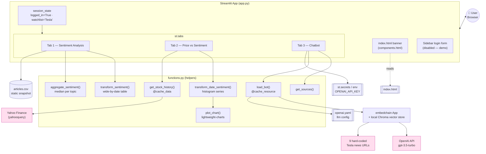
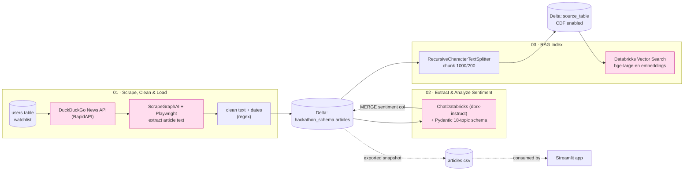
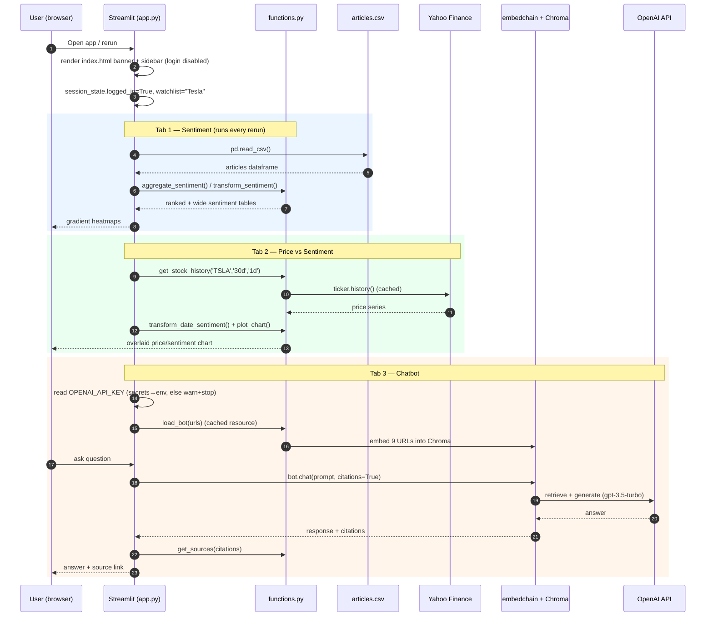
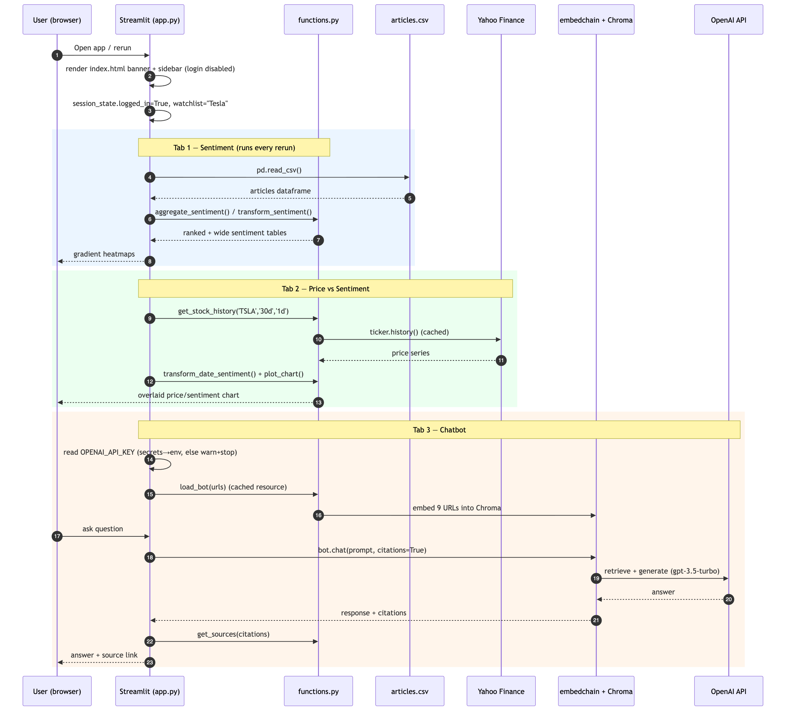

# GlobePulse — Architecture & Information Flow

GlobePulse is a financial-news **sentiment monitoring** app. It has two distinct halves:

| Plane | Status in this repo | Where it lives |
|-------|--------------------|----------------|
| **Online app** (serving / demo) | ✅ Active — what runs today | `app.py`, `functions.py`, `index.html`, `articles.csv`, `openai.yaml`, `.streamlit/` |
| **Offline data pipeline** (ingest + enrich) | 💤 Dormant — present but disabled | `databricks_notebooks/*.ipynb` (Databricks calls in `app.py`/`functions.py` are commented out) |

The live demo decouples itself from Databricks by reading a **static `articles.csv`** snapshot instead of querying the Delta tables that the notebooks would normally populate.

---

## 1. Current (Live Demo) Architecture

This is what actually executes when you run `streamlit run app.py`.

### Per-tab behaviour

- **Tab 1 — Sentiment Analysis** (`app.py:95-138`)
  Reads `articles.csv`, normalises the `sentiment` JSON string (`null → None`, then `eval`), then:
  - `aggregate_sentiment()` → median score per topic across all articles (a ranked summary table).
  - `transform_sentiment()` → wide table (rows = topics, columns = dates).
  Both are rendered as `RdYlGn` gradient heatmaps via pandas Styler.

- **Tab 2 — Price vs Sentiment** (`app.py:142-154`)
  `get_stock_history('TSLA', '30d', '1d')` pulls adjusted close prices from **Yahoo Finance**; `transform_date_sentiment()` turns the overall-sentiment row into a colored histogram series. `plot_chart()` overlays both on a TradingView **lightweight-charts** panel (area = price, histogram = sentiment intensity).

- **Tab 3 — Chatbot** (`app.py:157-207`)
  `load_bot()` builds an **embedchain** `App` from `openai.yaml`, embeds 9 hard-coded Tesla article URLs into a local **Chroma** vector store, and answers questions via RAG against the **OpenAI** API. The `OPENAI_API_KEY` is read from `st.secrets` with an env-var fallback and a graceful "disabled" warning if absent (`app.py:171-185`).

> **Note on tab execution:** Streamlit runs *all three* `with tab:` blocks on every rerun — tabs are switched client-side. That is why a missing key in Tab 3 previously crashed the whole page, and why the secret read is now guarded.

---

## 2. Original (Intended) Databricks Pipeline

The notebooks describe the production ingest path that the app was designed to consume. It is currently bypassed (the `databricks.sql` connection and `get_data`/`find_user` helpers are commented out), but it explains where `articles.csv`'s columns and the sentiment schema come from.

| Notebook | Role | Key tech |
|----------|------|----------|
| `01. Scrape, Clean & Load` | Create `users`/`articles` tables; fetch news URLs per watchlist company; scrape & clean full text; append to Delta | DuckDuckGo (RapidAPI), ScrapeGraphAI, Playwright, Spark/Delta |
| `02. Extract & Analyze Sentiment` | Per-topic structured sentiment (18 topics, −1..1 or null) and `MERGE` back into `articles.sentiment` | LangChain, ChatDatabricks `dbrx-instruct`, Pydantic |
| `03. RAG` | Chunk articles → `source_table` → continuous Vector Search index for retrieval QA | Databricks Vector Search, `bge-large-en`, RetrievalQA |

> In the **live app**, Notebook 02's sentiment schema is reproduced in `articles.csv`'s `sentiment` column, and Notebook 03's Databricks Vector Search is replaced by embedchain + local Chroma over a handful of URLs.

---

## 3. Information Flow (Request Lifecycle)

End-to-end sequence for a single page load + a chatbot question.

### How the data is shaped along the way

1. **Source record** (`articles.csv` row): `url, content, company_name, date, sentiment`. The `sentiment` field is a JSON string mapping 18 topics → score in `[-1, 1]` or `null` (e.g. `overall_sentiment`, `layoffs`, `revenue_growth`, …).
2. **Sentiment plane** splits two ways: a **topic median** summary (`aggregate_sentiment`) and a **topic × date** matrix (`transform_sentiment`). The `overall_sentiment` row is further reshaped into a signed-color histogram series for the price chart.
3. **Price plane** is fetched independently from Yahoo Finance and joined *visually* (shared time axis) rather than in data — sentiment and price are two overlaid series, not a merged table.
4. **Chat plane** is fully independent of the CSV: it builds its own retrieval index from hard-coded URLs and talks to OpenAI.

---

## 4. Key Files

| File | Responsibility |
|------|----------------|
| `app.py` | Streamlit entrypoint, layout, tabs, session state, secret handling |
| `functions.py` | Pure helpers: sentiment aggregation/transform, stock fetch, chart render, bot loader (cached) |
| `articles.csv` | Static demo dataset (stand-in for the Delta `articles` table) |
| `openai.yaml` | embedchain LLM config (`gpt-3.5-turbo-0125`, temp 0, streaming) |
| `index.html` | HTML/CSS hero banner injected at top of the page |
| `.streamlit/config.toml` | Dark theme + orange primary color |
| `.streamlit/secrets.toml` | (not committed) `[openai_credentials] API_KEY` for the chatbot |
| `databricks_notebooks/` | Dormant offline pipeline: ingest → sentiment → RAG index |

## 5. External Dependencies

| Service | Used by | Required for |
|---------|---------|--------------|
| Yahoo Finance (`yahooquery`) | Tab 2 | Stock price chart |
| OpenAI API | Tab 3 (via embedchain) | Chatbot answers |
| Chroma (local, bundled w/ embedchain) | Tab 3 | Vector store for RAG |
| *(dormant)* Databricks Delta + Vector Search, DuckDuckGo/RapidAPI, ScrapeGraphAI | notebooks | Production ingest/enrich |
