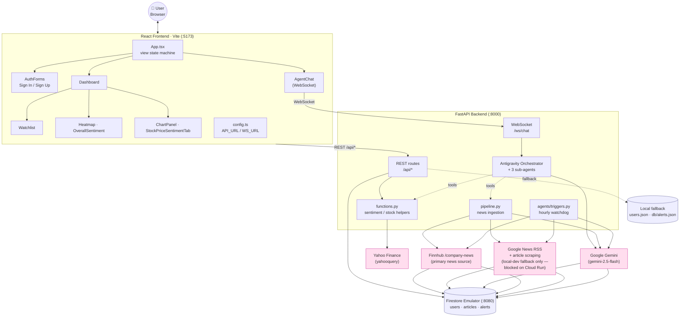
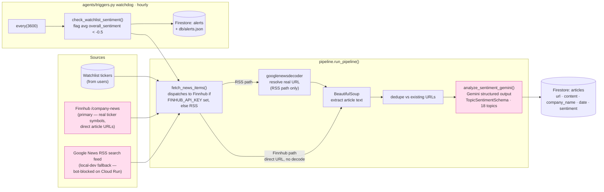
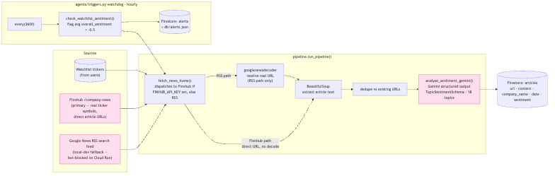
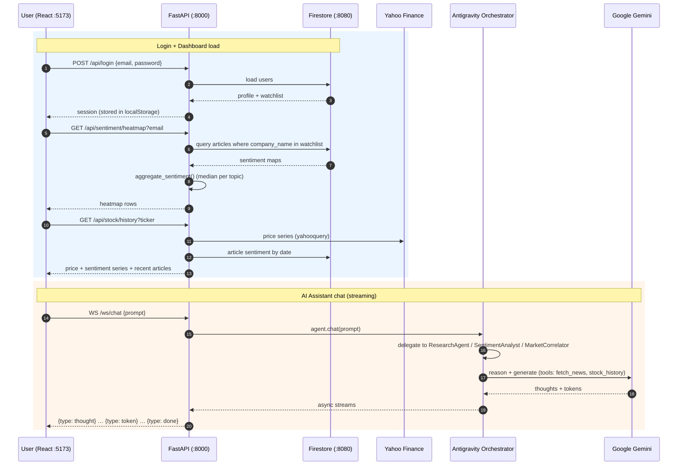
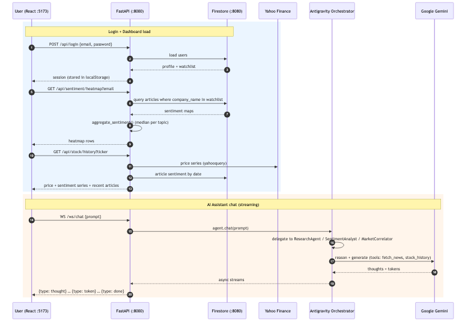

# GlobePulse — Architecture & Information Flow

GlobePulse is a financial-news **sentiment monitoring** platform. It is built as a
decoupled **React + FastAPI** application backed by **Google Cloud Firestore** and
powered by **Google Gemini** (via the **Google Antigravity** agent SDK).

| Plane | Role | Where it lives |
|-------|------|----------------|
| **Frontend** (SPA) | Dashboard, auth, charts, AI chat | `frontend/` (React + Vite + TypeScript, served on `:5173`) |
| **Backend** (API) | REST + WebSocket, agents, ingestion | `backend/` (FastAPI on `:8000`) |
| **Data store** | Users, articles, alerts | Firestore (local emulator on `:8080`), with local JSON fallbacks |
| **Intelligence** | Sentiment scoring + conversational agent | Google Gemini through `google-antigravity` |

The frontend never talks to Firestore or Gemini directly — everything flows through the
FastAPI backend over REST (`/api/*`) and a streaming WebSocket (`/ws/chat`).

---

## 1. Current Architecture

This is what runs when you execute `make start` (or `./start.sh`): the Firestore
emulator, the FastAPI backend, and the React dev server come up together.


```mermaid
flowchart TB
    user(("👤 User<br/>Browser"))

    subgraph FE["React Frontend · Vite (:5173)"]
        app["App.tsx<br/>view state machine"]
        auth["AuthForms<br/>Sign In / Sign Up"]
        dash["Dashboard"]
        wl["Watchlist"]
        hm["Heatmap · OverallSentiment"]
        chart["ChartPanel · StockPriceSentimentTab"]
        chat["AgentChat<br/>(WebSocket)"]
        cfg["config.ts<br/>API_URL / WS_URL"]
    end

    subgraph BE["FastAPI Backend (:8000)"]
        rest["REST routes<br/>/api/*"]
        ws["WebSocket<br/>/ws/chat"]
        orch["Antigravity Orchestrator<br/>+ 3 sub-agents"]
        pipe["pipeline.py<br/>news ingestion"]
        trig["agents/triggers.py<br/>hourly watchdog"]
        fn["functions.py<br/>sentiment / stock helpers"]
    end

    fs[("Firestore Emulator (:8080)<br/>users · articles · alerts")]
    localjson[("Local fallback<br/>users.json · db/alerts.json")]

    gemini["Google Gemini<br/>(gemini-2.5-flash)"]
    yahoo["Yahoo Finance<br/>(yahooquery)"]
    finnhub["Finnhub /company-news<br/>(primary news source)"]
    gnews["Google News RSS<br/>+ article scraping<br/>(local-dev fallback only —<br/>blocked on Cloud Run)"]

    user <--> FE
    app --> auth & dash & chat
    dash --> wl & hm & chart
    FE -->|REST /api/*| rest
    chat -->|WebSocket| ws

    rest --> fs
    rest --> fn
    fn --> yahoo
    rest -. fallback .-> localjson

    ws --> orch
    orch --> gemini
    orch -. tools .-> pipe & fn

    pipe --> finnhub & gnews & gemini --> fs
    trig --> finnhub & gnews & gemini --> fs

    classDef ext fill:#fde,stroke:#c39;
    classDef data fill:#eef,stroke:#669;
    class gemini,yahoo,finnhub,gnews ext;
    class fs,localjson data;
```


### Frontend (`frontend/`)

A single-page React app (Vite + TypeScript + Tailwind, `lucide-react` icons).

- **`App.tsx`** — top-level view state machine (`home · dashboard · signin · signup · about · contact · faq`), dark/light theme, and session restore from `localStorage` (`globepulse_user`).
- **`components/AuthForms.tsx`** — Sign In / Sign Up, backed by `/api/login` and `/api/signup`.
- **`components/Dashboard.tsx`** — authenticated view that composes the widgets below.
- **`components/Watchlist.tsx`** — reads/writes the user's watchlist via `/api/watchlist`.
- **`components/Heatmap.tsx` / `OverallSentiment.tsx`** — render aggregated topic sentiment from `/api/sentiment/heatmap`.
- **`components/ChartPanel.tsx` / `StockPriceSentimentTab.tsx` / `StockTrendDetails.tsx`** — overlay price vs. sentiment from `/api/stock/history` (TradingView lightweight-charts style series).
- **`components/AgentChat.tsx`** — connects to `/ws/chat` and streams the assistant's *thoughts* and *tokens* live.
- **`config.ts`** — derives `API_URL` (`:8000`) and `WS_URL` from the current host.

### Backend (`backend/`)

FastAPI app (`main.py`) with CORS open to the Vite origin.

| Module | Responsibility |
|--------|----------------|
| `main.py` | FastAPI app: REST routes, `/ws/chat` WebSocket, startup seeding, CORS |
| `config.py` | `pydantic-settings` config; loads `.env`, exposes `GEMINI_API_KEY`/`GOOGLE_API_KEY`, wires the Firestore emulator host |
| `database.py` | Firestore client + `users` / `articles` / `alerts` access; local `users.json` fallback; demo user + mock article seeding |
| `functions.py` | Pure helpers: sentiment aggregation/transform, `get_stock_history()` (yahooquery), `analyze_sentiment_gemini()`, password hashing |
| `pipeline.py` | News ingestion: Finnhub `/company-news` (primary) or Google News RSS (local-dev fallback) → URL resolve → scrape → Gemini structured sentiment → Firestore; defines `TopicSentimentSchema` (18 topics) |
| `agents/orchestrator.py` | Antigravity orchestrator agent + 3 sub-agents (ResearchAgent, SentimentAnalyst, MarketCorrelator) |
| `agents/tools.py` | Agent tools: `fetch_news_tool`, `get_stock_history_tool` |
| `agents/triggers.py` | Hourly watchdog (`every(3600, …)`) that flags critical sentiment drops as alerts |

### REST surface (`/api/*`)

| Route | Method | Purpose |
|-------|--------|---------|
| `/api/signup` | POST | Create a user (SHA-256 password hash, default watchlist) |
| `/api/login` | POST | Authenticate, return profile + watchlist |
| `/api/watchlist` | GET / POST | Read or update a user's watchlist |
| `/api/sentiment/heatmap` | GET | Aggregated topic sentiment across the user's watchlist |
| `/api/stock/history` | GET | Price series + daily sentiment series + recent articles |
| `/api/pipeline/run` | POST | Kick off the ingestion pipeline as a background task |
| `/api/alerts` | GET | Recent watchdog alerts (Firestore, else `db/alerts.json`) |
| `/api/subscription/plans` | GET | Get subscription plan tiers (Starter Free, Pro Trader ₹159, Enterprise ₹299) |
| `/api/subscription/create-order` | POST | Create Razorpay payment order for paid tiers |
| `/api/subscription/verify-payment` | POST | Verify Razorpay HMAC SHA256 payment signature and grant plan |
| `/ws/chat` | WS | Streaming conversation with the Antigravity orchestrator |

---

## 2. News Ingestion & Sentiment Pipeline

`pipeline.run_pipeline()` builds the `articles` collection. It is invoked on demand
via `POST /api/pipeline/run`, from the CLI (`python backend/pipeline.py --ticker TSLA`),
or indirectly by the agent's `fetch_news_tool`. The hourly **watchdog** reuses the same
scraping + scoring helpers to raise alerts.


```mermaid
flowchart LR
    subgraph SRC["Sources"]
        wl[("Watchlist tickers<br/>(from users)")]
        finnhub["Finnhub /company-news<br/>(primary — real ticker symbols,<br/>direct article URLs)"]
        rss["Google News RSS search feed<br/>(local-dev fallback —<br/>bot-blocked on Cloud Run)"]
    end

    subgraph ING["pipeline.run_pipeline()"]
        fetch["fetch_news_items()<br/>dispatches to Finnhub if<br/>FINHUB_API_KEY set, else RSS"]
        decode["googlenewsdecoder<br/>resolve real URL<br/>(RSS path only)"]
        scrape["BeautifulSoup<br/>extract article text"]
        dedupe["dedupe vs existing URLs"]
        score["analyze_sentiment_gemini()<br/>Gemini structured output<br/>TopicSentimentSchema · 18 topics"]
    end

    art[("Firestore: articles<br/>url · content · company_name · date · sentiment")]

    wl --> fetch
    finnhub --> fetch
    rss --> fetch
    fetch -->|RSS path| decode --> scrape
    fetch -->|Finnhub path<br/>direct URL, no decode| scrape
    scrape --> dedupe --> score --> art

    subgraph WD["agents/triggers.py watchdog · hourly"]
        every["every(3600)"]
        check["check_watchlist_sentiment()<br/>flag avg overall_sentiment < -0.5"]
        alert[("Firestore: alerts<br/>+ db/alerts.json")]
    end
    every --> check --> fetch
    check --> alert

    classDef ext fill:#fde,stroke:#c39;
    class finnhub,rss,score ext;
```



**Sentiment schema.** Every article carries a `sentiment` map scoring 18 financial
topics (`layoffs`, `revenue_growth`, `product_launches`, `overall_sentiment`, …), each in
`[-1, 1]` or `null` when the topic is not present. Gemini is asked to return this exact
structure via `response_schema=TopicSentimentSchema`; if Gemini is unavailable the pipeline
falls back to a neutral default so ingestion never hard-fails.

> **Seeding.** On startup, `database.seed_demo_users()` seeds two demo accounts
> (`demo1@/demo2@globepulse.com`, password `password123`) and a set of mock articles with
> realistic sentiment, so the dashboard is populated without running the live scraper.
> `articles.csv` remains in the repo as a legacy static snapshot of this dataset.

---

## 3. Information Flow (Request Lifecycle)

End-to-end sequence for a login + dashboard load, and for a streaming agent chat.


```mermaid
sequenceDiagram
    autonumber
    participant U as User (React :5173)
    participant A as FastAPI (:8000)
    participant D as Firestore (:8080)
    participant Y as Yahoo Finance
    participant O as Antigravity Orchestrator
    participant G as Google Gemini

    rect rgb(235,245,255)
    note over U,D: Login + Dashboard load
    U->>A: POST /api/login {email, password}
    A->>D: load users
    D-->>A: profile + watchlist
    A-->>U: session (stored in localStorage)
    U->>A: GET /api/sentiment/heatmap?email
    A->>D: query articles where company_name in watchlist
    D-->>A: sentiment maps
    A->>A: aggregate_sentiment() (median per topic)
    A-->>U: heatmap rows
    U->>A: GET /api/stock/history?ticker
    A->>Y: price series (yahooquery)
    A->>D: article sentiment by date
    A-->>U: price + sentiment series + recent articles
    end

    rect rgb(255,245,235)
    note over U,G: AI Assistant chat (streaming)
    U->>A: WS /ws/chat {prompt}
    A->>O: agent.chat(prompt)
    O->>O: delegate to ResearchAgent / SentimentAnalyst / MarketCorrelator
    O->>G: reason + generate (tools: fetch_news, stock_history)
    G-->>O: thoughts + tokens
    O-->>A: async streams
    A-->>U: {type: thought} … {type: token} … {type: done}
    end
```



### How the data is shaped

1. **User record** (`users` collection / `users.json`): `first_name, last_name, email, phone, password_hash, watchlist` (comma-separated company names).
2. **Article record** (`articles` collection): `url, content, company_name, date, sentiment` where `sentiment` is the 18-topic map.
3. **Heatmap plane**: `aggregate_sentiment()` reduces all watchlist articles to a median score + count (`N`) per topic.
4. **Price-vs-sentiment plane**: `transform_sentiment()` → `transform_date_sentiment()` produce a signed, colored daily sentiment series that is overlaid on the Yahoo Finance price series (joined visually on a shared time axis, not merged in data).
5. **Chat plane**: the orchestrator delegates to sub-agents and calls the news/stock tools as needed, streaming reasoning and answer tokens back over the WebSocket.

---

## 4. Key Files

| File | Responsibility |
|------|----------------|
| `backend/main.py` | FastAPI entrypoint: REST + WebSocket, CORS, startup seeding |
| `backend/config.py` | Settings (`.env`), Gemini key exposure, Firestore emulator wiring |
| `backend/database.py` | Firestore access + local fallback + demo/mock seeding |
| `backend/functions.py` | Sentiment aggregation/transform, stock history, hashing |
| `backend/pipeline.py` | News scraping + Gemini sentiment ingestion; `TopicSentimentSchema` |
| `backend/agents/orchestrator.py` | Orchestrator + sub-agent configuration (Antigravity) |
| `backend/agents/tools.py` | `fetch_news_tool`, `get_stock_history_tool` |
| `backend/agents/triggers.py` | Hourly sentiment watchdog → alerts |
| `frontend/src/App.tsx` | View state machine, theme, session |
| `frontend/src/components/*` | Dashboard, auth, watchlist, heatmap, charts, agent chat |
| `frontend/src/config.ts` | REST/WS base URLs |
| `articles.csv` | Legacy static article snapshot (superseded by Firestore + seeding) |
| `Makefile` / `start.sh` / `stop.sh` | Orchestrate the emulator + backend + frontend |

## 5. External Dependencies

| Service | Used by | Required for |
|---------|---------|--------------|
| Google Gemini (`google-generativeai`, via `google-antigravity`) | pipeline, watchdog, agents | Structured sentiment + conversational assistant |
| Google Antigravity SDK | `agents/*` | Orchestrator + sub-agents + streaming |
| Google Cloud Firestore (local emulator) | `database.py`, routes | Users / articles / alerts persistence |
| Yahoo Finance (`yahooquery`) | `functions.get_stock_history` | Stock price series |
| Finnhub (`/company-news`) | `pipeline.py`, `agents/triggers.py` | News discovery — primary source (`FINHUB_API_KEY`) |
| Google News RSS + `googlenewsdecoder` + BeautifulSoup | `pipeline.py`, `agents/triggers.py` | News discovery + article scraping — local-dev fallback (Cloud Run blocks Google's bot-detection) |

## 6. Running Locally

```bash
make install          # backend + frontend dependencies
make start            # Firestore emulator + FastAPI + React (or ./start.sh)
make stop             # stop all services
```

| Service | URL |
|---------|-----|
| Frontend UI | http://localhost:5173 |
| FastAPI docs (Swagger) | http://localhost:8000/docs |
| Firestore emulator console | http://localhost:4001 |

Set `GEMINI_API_KEY` (or `GOOGLE_API_KEY`) in a `.env` file or the environment for the
AI agents and the sentiment pipeline. See `make help` for individual dev targets
(`make dev-backend`, `make dev-frontend`, `make dev-emulator`).

> Historical design docs for the earlier pre-migration system are preserved under
> [`docs/archive/`](docs/archive/).
