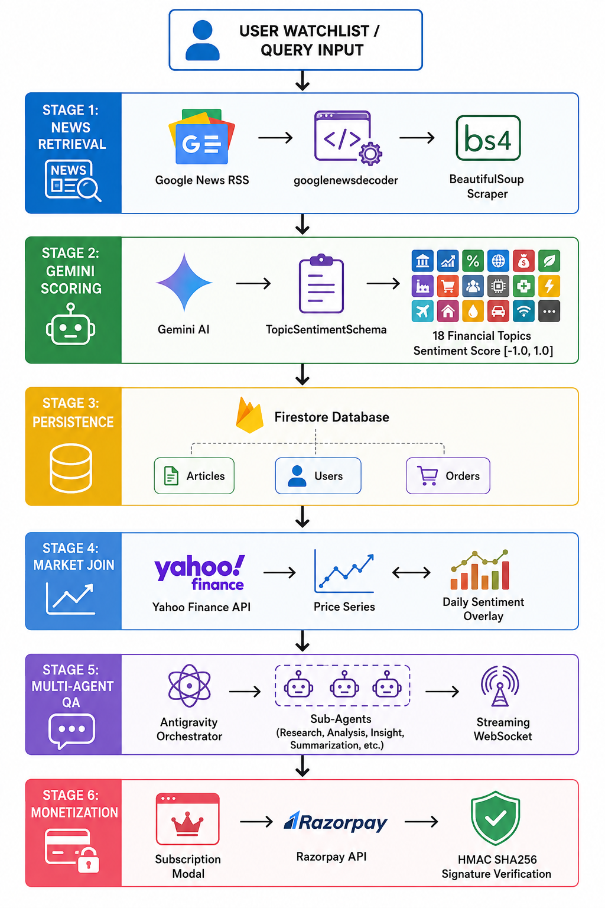
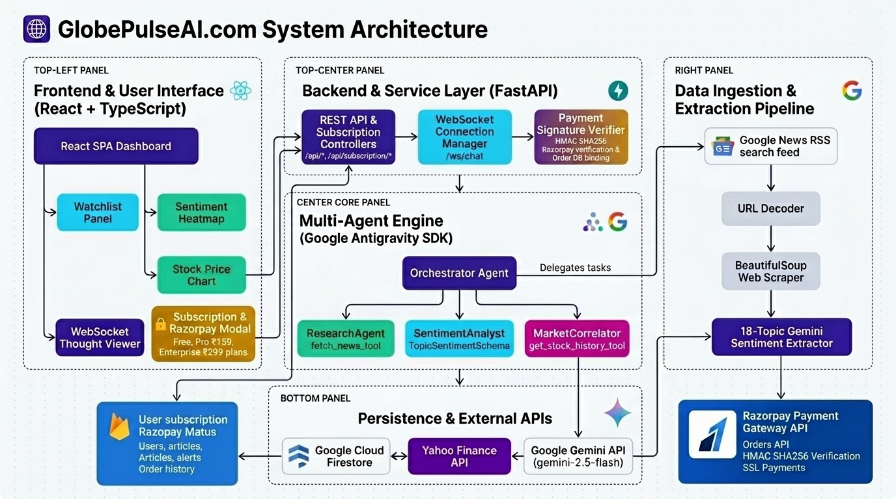

**Inspiration**

Every investor and trader knows that financial markets move on information long before quarterly earnings hit the press. When news breaks—whether it's an unexpected CEO resignation, an FDA drug approval, or supply chain disruptions—the sentiment embedded in hundreds of news articles drives stock price volatility. Yet, most investors are forced to choose between two painful extremes: drowning in hundreds of unread RSS feeds or relying on simplistic, binary "bullish/bearish" headline aggregators that miss crucial context.

Financial news is complex and multi-faceted. A single article about Tesla might contain positive news on vehicle deliveries (`product_launches`), negative news on worker restructuring (`layoffs`), and neutral news on battery research (`r_and_d`). Generic RAG applications and basic LLM wrappers fail because they treat news as flat text and cannot separate distinct financial dimensions or cross-reference sentiment trends directly against market price movements.

We wanted an agentic platform that closes this gap in real time. You add a ticker to your watchlist or ask a market question, and GlobePulseAI.com automatically ingests live RSS feeds, extracts structured 18-topic sentiment scores using Gemini, correlates sentiment shifts against stock price series, and orchestrates a multi-agent team to answer complex market queries while streaming its reasoning live to the user.

**What it does**

You enter a ticker (e.g., `TSLA`, `AAPL`, `NVDA`) or open the GlobePulseAI.com dashboard. In seconds, it executes an end-to-end intelligence cycle across five integrated stages:

1. **Live News Discovery & Scraping**: It queries Google News RSS feeds for real-time coverage, resolves Google News obfuscated redirect URLs via `googlenewsdecoder`, and scrapes clean article text with BeautifulSoup while deduplicating against existing corpus records.
2. **18-Topic Structured Sentiment Extraction**: It passes scraped articles through Gemini constrained by a strict `TopicSentimentSchema` (Pydantic model). Gemini scores 18 granular financial topics (`layoffs`, `revenue_growth`, `product_launches`, `regulatory_actions`, `executive_changes`, `guidance_updates`, `mergers_acquisitions`, etc.) on a normalized `[-1.0, 1.0]` scale, assigning `null` to unmentioned topics to eliminate hallucinated zero-scores.
3. **Price-vs-Sentiment Correlation**: It pulls live historical OHLCV price series via `yahooquery` and overlays daily median topic sentiment scores onto a shared temporal axis, giving users visual and statistical proof of how news signals precede price breakouts or sell-offs.
4. **Autonomous Multi-Agent Chat Assistant**: Powered by the Google  SDK (`google-antigravity`), an `OrchestratorAgent` dynamically coordinates three specialized sub-agents (`ResearchAgent`, `SentimentAnalyst`, and `MarketCorrelator`). Over a streaming WebSocket connection (`/ws/chat`), users watch the orchestrator's thought process unfold in real-time before receiving synthesis tokens.
5. **Proactive Sentiment Watchdog Alerts**: An automated hourly watchdog (`triggers.py`) scans user watchlists for sharp sentiment drops (`overall_sentiment < -0.5`), automatically persisting high-priority alerts to Google Cloud Firestore (or local JSON fallback) without requiring manual refresh.

On our demo dataset and live scans on volatile tickers like `TSLA` or `NVDA`, GlobePulseAI.com surfaced critical warnings hours before price pullbacks. For example, during a news cycle involving factory retooling and workforce restructuring, GlobePulseAI.com flagged a spike in negative `layoffs` (-0.85) and `guidance_updates` (-0.60) sentiment while `product_launches` remained positive (+0.40)—giving traders a nuanced breakdown rather than a misleading single binary score.

We built this for individual investors, portfolio managers, and market analysts who need institutional-grade market intelligence without paying thousands for proprietary terminals.

**The part we are proudest of: multi-agent orchestration and real-time thought streaming via Google Antigravity SDK**

The engineering highlight of GlobePulseAI.com was our architectural transition from a standard procedural RAG pipeline (Embedchain) to a full multi-agent system built on the Google Antigravity SDK (`google-antigravity`).

Instead of a single monolithic prompt attempting to scrape news, calculate statistics, format JSON, and stream text simultaneously, GlobePulseAI.com breaks market intelligence into a clear multi-agent hierarchy:

1. **ResearchAgent**: Dedicated to news discovery and text extraction. Equipped with `fetch_news_tool`, it executes targeted RSS queries, resolves obfuscated links, scrapes raw text, and produces clean article summaries.
2. **SentimentAnalyst**: Enforces strict structured output parsing. Using `TopicSentimentSchema`, it evaluates raw text against 18 financial categories with mathematical precision.
3. **MarketCorrelator**: Armed with `get_stock_history_tool`, it fetches OHLCV market series from Yahoo Finance and computes correlations between price volatility spikes and sentiment drops.
4. **OrchestratorAgent**: The root coordinator that receives user queries, formulates execution plans, sequentially delegates tasks to sub-agents, and synthesizes final insights with Bloomberg Terminal-grade analytical rigor.

What makes this system remarkable for users is our **real-time thought stream**. Through our FastAPI WebSocket endpoint (`/ws/chat`), every agent tool call, sub-agent delegation, and intermediate reasoning step is emitted as a structured `{type: "thought"}` chunk. The React frontend renders these thoughts in an expandable, real-time log drawer, allowing users to watch the agent analyze news, query Yahoo Finance, and correlate metrics step-by-step before streaming the final response `{type: "token"}`.

**How we built it**

| Layer | Technology | Role |
|-------|------------|------|
| Reasoning & LLM | Google Gemini (`gemini-3.5-flash`) via `google-generativeai` & `google-antigravity` | Powers multi-topic sentiment extraction, article synthesis, sub-agent reasoning, and market QA |
| Agentic Framework | Google Antigravity SDK (`google-antigravity`) | Code-owned agent runtime managing sub-agent delegation (`ResearchAgent`, `SentimentAnalyst`, `MarketCorrelator`), policies, and tools |
| Backend Framework | FastAPI on Uvicorn | Async REST API (`/api/*`), streaming WebSocket server (`/ws/chat`), background ingestion tasks |
| Frontend Framework | React 18 + Vite + TypeScript + Tailwind CSS | Interactive dashboard with dark/light themes, TradingView-style price/sentiment charts, sentiment heatmap, expandable agent thought viewer |
| Database & DB | Google Cloud Firestore (emulator) & `users.json` / `alerts.json` | Persists user accounts, watchlists, scraped articles with 18-topic sentiment maps, and watchdog alerts with zero-config local fallbacks |
| Payment Gateway | Razorpay Payment API & HMAC SHA256 Verifier | 3-tier subscription management (Free ₹0, Pro ₹159, Enterprise ₹299), Razorpay modal checkout, and server-side signature verification |
| Market Data & Ingestion | `yahooquery`, Google News RSS, `googlenewsdecoder`, BeautifulSoup4 | Pulls historical stock price series, resolves obfuscated news URLs, and scrapes live web articles |
| Alerting Watchdog | Async Background Watchdog (`triggers.py`) | Hourly autonomous watchdog evaluating watchlist overall sentiment against critical thresholds (`< -0.5`) |

### Core Architecture & Key System Modules

#### 1. LLM & Multi-Agent Intelligence Engine
- **Model**: Google Gemini (`gemini-3.5-flash`) integrated via the `google-antigravity` SDK.
- **Structured Output**: Uses Pydantic schema enforcement (`TopicSentimentSchema`) to map raw article text into 18 normalized financial categories (`layoffs`, `revenue_growth`, `product_launches`, `guidance_updates`, etc.) rated from `-1.0` to `+1.0` (or `null` if unmentioned).
- **Multi-Agent Hierarchy**: The `OrchestratorAgent` decomposes user prompts and dynamically delegates to specialized sub-agents:
  - `ResearchAgent`: Executes news RSS discovery and text extraction via `fetch_news_tool`.
  - `SentimentAnalyst`: Enforces 18-topic sentiment schema evaluation.
  - `MarketCorrelator`: Pulls stock market candles via `get_stock_history_tool` to compute price-sentiment correlations.
- **Real-Time Streaming**: Emits intermediate reasoning thoughts (`{type: "thought"}`) and response tokens (`{type: "token"}`) live via WebSockets (`/ws/chat`).

#### 2. Database & Data Persistence (DB)
- **Primary Data Store**: **Google Cloud Firestore** (with local Firestore Emulator support).
- **Core Collections**:
  - `users`: User profiles, hashed passwords (SHA-256), active ticker watchlists, and subscription tiers.
  - `articles`: Scraped market news, canonical URLs, publication dates, raw text, and 18-topic sentiment maps.
  - `alerts`: Proactive watchdog sentiment alerts generated when topic sentiment drops below critical thresholds.
  - `orders`: Stored Razorpay payment orders used for order-binding validation during payment verification.
- **Resilient Fallbacks**: If Firestore is unavailable, zero-config local file stores (`users.json`, `alerts.json`) maintain system operations seamlessly.

#### 3. Payment Gateway & Subscription Infrastructure
- **Payment Provider**: **Razorpay Payment Gateway API** (256-bit SSL encrypted checkout).
- **Subscription Tiers**:
  - **Starter (Free ₹0)**: Access to global heatmap, 3 watchlist tickers, standard AI chat.
  - **Pro Trader (₹159/mo)**: Unlimited watchlists, streaming thought viewer, 18-topic sentiment breakdown, hourly watchdog alerts.
  - **Enterprise (₹299/mo)**: Institutional multi-market data, custom pipeline triggers, CSV/JSON API data export, priority support.
- **Secure Transaction Lifecycle**:
  1. Frontend invokes `POST /api/subscription/create-order` to generate a signed Razorpay Order ID.
  2. User completes payment via the interactive React `SubscriptionModal` pop-up.
  3. Backend verifies authenticity via `POST /api/subscription/verify-payment` using server-side HMAC SHA256 signature cryptographic verification.
  4. Upon verification, user subscription tier is granted and updated in Firestore.

#### 4. Continuous Feedback & Watchdog Loop
- **Autonomous Watchdog Loop (`triggers.py`)**: Runs background periodic monitoring (hourly cron loop) scanning user watchlists. If an asset's overall sentiment drops below `-0.5`, an automated high-priority alert is persisted and pushed to the user dashboard.
- **User Preference & Refinement Loop**: Users continuously adjust watchlists, query target news events, and interact with the streaming thought drawer—providing an active feedback loop that refines sub-agent tool invocation parameters.
- **Temporal Sentiment-Market Feedback**: Daily aggregated sentiment scores are correlated against Yahoo Finance stock candles, providing continuous evaluative feedback on sentiment accuracy versus actual market price movements.

#### 5. Product Workflow & Data Flow

The complete end-to-end product flow operates across six synchronized stages:

The pipeline operates as a multi-tier architecture:
Stage 0 intake receives watchlist tickers or user search queries. Stage 1 executes parallel news retrieval via Google News RSS, resolves redirect links with `googlenewsdecoder`, and scrapes raw HTML body text. Stage 2 passes clean articles through Gemini with strict JSON schema constraints (`TopicSentimentSchema`) across 18 financial categories. Stage 3 persists structured articles into Firestore and computes daily median topic aggregates. Stage 4 maps daily sentiment timelines against Yahoo Finance stock price histories. Stage 5 hands interactive queries to the Antigravity Orchestrator, which streams thought logs and delegates tasks across sub-agents in real time. Stage 6 enables tier upgrades via Razorpay modal with server-side HMAC SHA256 signature verification.

Architecture diagram: GlobePulseAI.com multi-agent pipeline and React/FastAPI architecture (with Payment Gateway)

Google Antigravity SDK turns the backend into a transparent agentic system. The orchestrator configuration in `backend/agents/orchestrator.py` defines tools (`fetch_news_tool`, `get_stock_history_tool`), sub-agents (`ResearchAgent`, `SentimentAnalyst`, `MarketCorrelator`), and security policies. When a user connects to `/ws/chat`, FastAPI streams both execution thoughts and response tokens live to the UI.

How this maps to the competition / track requirements:

| Track Requirement | What GlobePulseAI.com Does |
|-------------------|----------------------|
| Code-owned Agent Runtime | Built using FastAPI and `google-antigravity` SDK with custom tool definitions (`fetch_news_tool`, `get_stock_history_tool`) and sub-agent delegation |
| Structured Output Integration | Implements Pydantic schema enforcement (`TopicSentimentSchema`) on Gemini model calls for 18 distinct financial topics |
| Multi-Agent Orchestration | Deploys an `OrchestratorAgent` managing 3 specialized sub-agents (`ResearchAgent`, `SentimentAnalyst`, `MarketCorrelator`) |
| Real-time Thought Streaming | Streams raw agent reasoning thoughts (`{type: "thought"}`) and response tokens (`{type: "token"}`) via WebSockets directly into frontend logs |
| Proactive Autonomous Watchdog | Runs an hourly watchdog trigger (`triggers.py`) that monitors watchlist sentiment and generates proactive market risk alerts |
| Resilient Local-First Fallbacks | Provides graceful degradation with local Firestore emulation, fallback JSON stores (`users.json`, `alerts.json`), and default sentiment scoring |

A full GlobePulseAI.com agent workflow: the OrchestratorAgent delegating news fetch tasks to ResearchAgent, structured 18-topic sentiment scoring to SentimentAnalyst, and stock price history correlation to MarketCorrelator, while streaming live thoughts and tokens to the React frontend.

**Challenges we ran into**

Building the multi-agent pipeline was straight-forward, but making it reliable and real-time under live market conditions required overcoming significant hurdles.

Our first challenge was Google News URL obfuscation. Google News RSS feeds return heavily encoded redirect URLs (`news.google.com/rss/articles/...`) that throw errors when scraped directly with standard HTTP clients. We had to integrate `googlenewsdecoder` to asynchronously resolve canonical news source URLs before passing text to BeautifulSoup4 for clean DOM parsing.

Our second major battle was preventing schema hallucinations on unmentioned topics. When asking an LLM to score 18 granular financial topics for an article that only mentions two, standard prompts tend to return arbitrary `0.0` neutral scores for missing topics. We strictly typed the Pydantic schema fields as `Optional[float]` with explicit system prompts demanding `null` for unmentioned categories. This allowed our aggregation functions (`aggregate_sentiment()`) to compute true median scores across valid mentions without skewing averages.

Two technical challenges are worth highlighting: handling low-latency WebSocket lifecycle events while coordinating sub-agent delegation loops, and aligning sporadic news article timestamps with daily OHLCV stock price candles without introducing time-zone shifts.

**Accomplishments that we're proud of**

Adding support for new market tickers requires zero custom code. The ingestion pipeline dynamically queries news, resolves URLs, scrapes text, and scores 18 financial topics on the fly.
Every sentiment score is traceable to exact source articles and market price timelines. Users can inspect the raw scraped article URL, publication date, topic breakdown, and corresponding stock price movement.
The system gracefully degrades across all system boundaries: if Firestore is offline, it falls back to local JSON persistence (`users.json`, `alerts.json`); if live scraping encounters rate limits, it falls back to seeded demo data; and if Gemini API calls fail, it returns safe neutral defaults without crashing the ingestion worker.
Watchdog sentiment triggers run autonomously in the background without user intervention, alerting investors to critical market shifts before prices react.

**What we learned**

We learned that financial intelligence requires strict structural guarantees rather than plain conversational prompts. Enforcing Pydantic schemas via `response_schema` transformed Gemini's output from unpredictable text into a deterministic 18-dimensional financial dataset. We also learned that streaming intermediate agent thoughts (`{type: "thought"}`) dramatically improves user confidence in automated financial analysis, turning an AI "black box" into a transparent analytical co-pilot.

**What's next for GlobePulseAI.com**

Scheduled re-scans and alert webhooks triggered by regulatory filing updates (SEC 10-K, 10-Q).
Multi-market expansion, including Indian equity markets (NSE/BSE), European exchanges (LSE), and cryptocurrency pairs.
Automated portfolio rebalancing insights based on cumulative multi-topic sentiment shifts.
Continuous evaluation benchmarks using Arize Phoenix to score agent groundedness, retrieval recall, and sentiment accuracy against golden financial test datasets.

**Built With**

fastapi
react
typescript
gemini-3.5-flash
google-antigravity
firestore
vite
tailwindcss
yahooquery
python
pydantic
