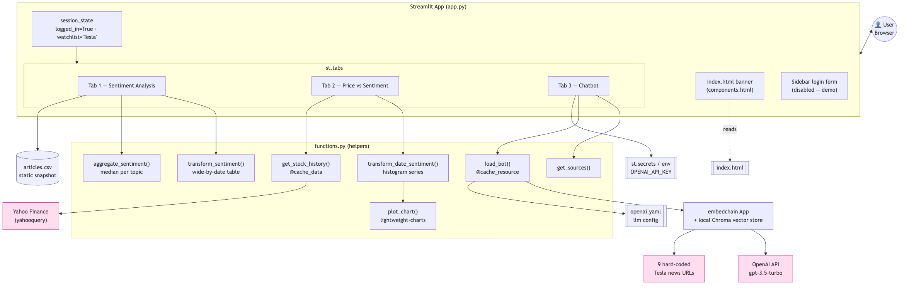

[](https://globe-pulse.streamlit.app/)

# GlobePulse AI: Financial News Monitoring and Sentiment Analysis

GlobePulse is a Streamlit-based app for tracking business and market-moving news, analyzing article sentiment, and comparing sentiment trends with stock price activity.

## Features
- **Sentiment Analysis:** Visualize news sentiment over time and by topic.
- **Price vs Sentiment:** Compare stock price behavior with sentiment signals.
- **Chat Assistant:** Ask questions about recent news using an embedded question-answering pipeline.
- **User Authentication:** Smooth sliding animation for Log In and Sign Up using local `users.json` persistence, complete with delayed mobile number collection.

## Local Setup
1. Clone the repository or use the existing local folder.
2. Create and activate the virtual environment:
   ```bash
   python3 -m venv .venv
   source .venv/bin/activate
   ```
3. Install dependencies:
   ```bash
   pip install -r requirements.txt
   ```
4. Run the app:
   ```bash
   streamlit run app.py
   ```

## Notes
- The current implementation uses a demo news dataset in `articles.csv`.
- The chatbot uses `embedchain` with a small demo index built from sample article URLs.
- `OPENAI_API_KEY` should be configured in Streamlit secrets or as an environment variable for chatbot functionality.
- User data for authentication is stored locally in `users.json`, which will be automatically generated upon your first sign up.

## Tech Stack
- Streamlit & Streamlit Option Menu
- OpenAI
- Embedchain
- YahooQuery
- Pandas, NumPy, Matplotlib

## Architecture
See [ARCHITECTURE.md](ARCHITECTURE.md) for the full architecture, information-flow diagrams, and explanation.



## Visuals

