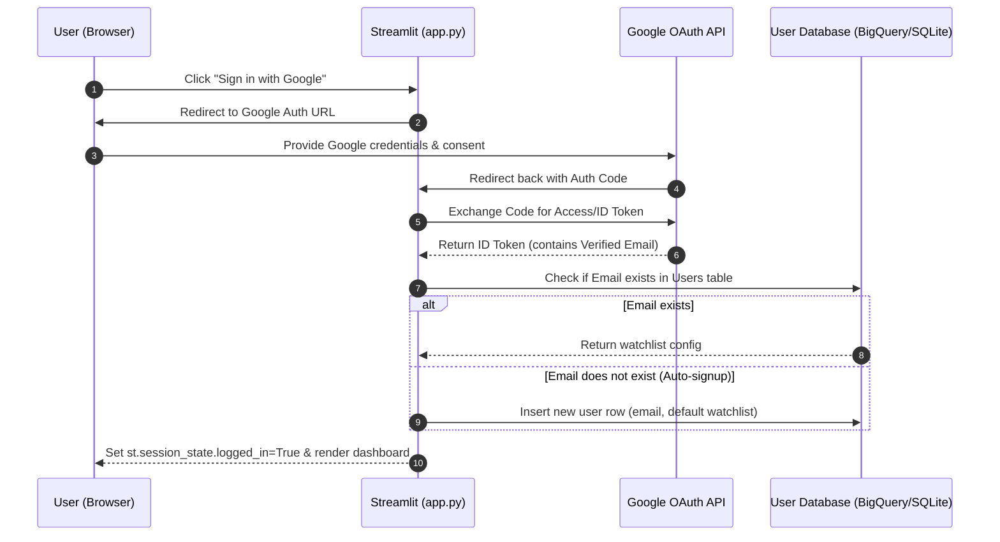

# Plan: Gmail Authentication & Authorization Integration

This document outlines the design and integration plan for replacing the local username-password authentication system in GlobePulse with Gmail-based authentication (Google Sign-In via OAuth 2.0 / OpenID Connect).

---

## 1. Overview & Benefits

Currently, GlobePulse uses a local SQLite database table with SHA-256 password hashing. Moving to Gmail-based authentication offers several key improvements:
*   **Security:** Offloads password storage and credential leakage risks to Google.
*   **User Experience:** One-click Login (SSO) without registering passwords.
*   **Verification:** Automatically verifies the user's email address.
*   **Ecosystem Integration:** Seamless integration with Google Cloud Platform (GCP) resources like BigQuery and Vertex AI that are already planned.

---

## 2. Recommended Architecture

We propose using **Google OAuth 2.0 & OpenID Connect** natively in the Python/Streamlit backend. 

### Auth Flow Diagram



---

## 3. Step-by-Step Implementation Roadmap

### Phase 1: Google Cloud Console Configuration
1.  Navigate to the [Google Cloud Console](https://console.cloud.google.com/).
2.  Create a project (or use the existing project for Vertex AI).
3.  Go to **APIs & Services > OAuth Consent Screen**:
    *   Configure user type (External or Internal).
    *   Add the application name, developer email, and authorized domains.
    *   Select scopes: `.../auth/userinfo.email` and `.../auth/userinfo.profile`.
4.  Go to **APIs & Services > Credentials > Create Credentials > OAuth Client ID**:
    *   Application type: **Web Application**.
    *   Authorized JavaScript Origins: `http://localhost:8501` (and production domain).
    *   Authorized Redirect URIs: `http://localhost:8501/` (and production callback domain).
5.  Download the client configuration JSON (`client_secret.json`) containing the **Client ID** and **Client Secret**.

### Phase 2: Secure Secret Management
Store the Client ID and Client Secret in Streamlit secrets (`.streamlit/secrets.toml`):
```toml
[google_oauth]
CLIENT_ID = "your-client-id.apps.googleusercontent.com"
CLIENT_SECRET = "your-client-secret"
REDIRECT_URI = "http://localhost:8501/"
```

### Phase 3: Backend Authentication Integration (`auth.py`)
Create a helper script `backend/auth.py` using `google-auth-oauthlib`:
```python
from google_auth_oauthlib.flow import Flow
import streamlit as st

def get_oauth_flow():
    return Flow.from_client_config(
        {
            "web": {
                "client_id": st.secrets["google_oauth"]["CLIENT_ID"],
                "client_secret": st.secrets["google_oauth"]["CLIENT_SECRET"],
                "auth_uri": "https://accounts.google.com/o/oauth2/auth",
                "token_uri": "https://oauth2.googleapis.com/token",
                "redirect_uris": [st.secrets["google_oauth"]["REDIRECT_URI"]]
            }
        },
        scopes=["https://www.googleapis.com/auth/userinfo.email", "openid"]
    )
```

### Phase 4: UI Login Button & Code Callback Exchange (`app.py`)
1.  **Authorization Trigger:** Render a login button linking to the Google consent page.
2.  **Callback Processing:** Detect the auth code returned in the query parameters (`st.query_params`).
3.  **Token Verification:** Retrieve user profile information:
    ```python
    # Inside app.py startup
    query_params = st.query_params
    if "code" in query_params:
        flow = get_oauth_flow()
        flow.fetch_token(code=query_params["code"])
        session = flow.authorized_session()
        userinfo = session.get("https://www.googleapis.com/oauth2/v1/userinfo").json()
        
        email = userinfo["email"]
        # Proceed with session login and database mapping
    ```

### Phase 5: Database Mapping Adjustments
Update the database user lookup from checking `username` / `password_hash` to a single key lookup by verified `email`:
```sql
SELECT watchlist FROM users WHERE email = ?;
```
If the email is new, automatically insert a new record to create the user account inline without a manual signup form.
